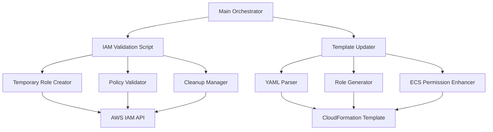

# Design Document

## Overview

This feature implements a two-phase approach: first validating IAM policy creation through temporary role testing, then updating the CloudFormation template to include a dedicated Bedrock AgentCore runtime IAM role. The design ensures robust error handling, security best practices, and seamless integration with the existing Cloud Optimization Assistant infrastructure.

## Architecture

### Component Architecture



### Data Flow

1. **Validation Phase**: Create temporary role → Attach policies → Validate → Cleanup
2. **Template Update Phase**: Parse existing template → Add new role → Update ECS permissions → Write new version

## Components and Interfaces

### 1. IAM Role Validator

**Purpose**: Validates that all required policies can be successfully attached to an IAM role.

**Interface**:
```python
class IAMRoleValidator:
    def validate_policies(self, policy_files: List[str]) -> ValidationResult
    def create_temporary_role(self) -> str  # Returns role ARN
    def attach_policies(self, role_name: str, policies: List[Dict]) -> bool
    def cleanup_temporary_role(self, role_name: str) -> bool
```

**Key Methods**:
- `validate_policies()`: Main validation orchestrator
- `create_temporary_role()`: Creates uniquely named temporary role
- `attach_policies()`: Attempts to attach all policy documents
- `cleanup_temporary_role()`: Ensures cleanup even on failure

### 2. CloudFormation Template Manager

**Purpose**: Handles reading, parsing, and updating CloudFormation templates.

**Interface**:
```python
class CloudFormationTemplateManager:
    def load_template(self, file_path: str) -> Dict
    def add_bedrock_agentcore_role(self, template: Dict) -> Dict
    def update_ecs_permissions(self, template: Dict) -> Dict
    def save_template(self, template: Dict, output_path: str) -> bool
```

**Key Methods**:
- `load_template()`: Parses YAML template into Python dict
- `add_bedrock_agentcore_role()`: Inserts new IAM role resource
- `update_ecs_permissions()`: Enhances existing ECS task role
- `save_template()`: Writes updated template to new version file

### 3. Policy Document Processor

**Purpose**: Handles loading and processing of JSON policy files.

**Interface**:
```python
class PolicyDocumentProcessor:
    def load_policy_files(self, policy_dir: str) -> List[Dict]
    def validate_policy_syntax(self, policy: Dict) -> bool
    def convert_to_inline_policy(self, policy: Dict, name: str) -> Dict
```

**Key Methods**:
- `load_policy_files()`: Reads all JSON policy files from directory
- `validate_policy_syntax()`: Ensures valid IAM policy structure
- `convert_to_inline_policy()`: Formats for CloudFormation inline policy

### 4. Main Orchestrator

**Purpose**: Coordinates the entire validation and template update process.

**Interface**:
```python
class BedrockAgentCoreIntegrator:
    def run_validation_and_update(self) -> IntegrationResult
    def validate_iam_policies(self) -> ValidationResult
    def update_cloudformation_template(self) -> UpdateResult
```

## Data Models

### ValidationResult
```python
@dataclass
class ValidationResult:
    success: bool
    temporary_role_arn: Optional[str]
    attached_policies: List[str]
    errors: List[str]
    cleanup_successful: bool
```

### UpdateResult
```python
@dataclass
class UpdateResult:
    success: bool
    output_file: str
    new_resources_added: List[str]
    existing_resources_modified: List[str]
    errors: List[str]
```

### IntegrationResult
```python
@dataclass
class IntegrationResult:
    validation_result: ValidationResult
    update_result: UpdateResult
    overall_success: bool
    summary: str
```

## Error Handling

### Error Categories

1. **AWS API Errors**
   - IAM permission denied
   - Resource already exists
   - Service limits exceeded
   - Network connectivity issues

2. **File System Errors**
   - Policy files not found
   - Template file read/write failures
   - Invalid JSON/YAML syntax

3. **Validation Errors**
   - Invalid policy documents
   - CloudFormation template structure issues
   - Resource naming conflicts

### Error Handling Strategy

```python
class ErrorHandler:
    def handle_aws_error(self, error: ClientError) -> ErrorResponse
    def handle_file_error(self, error: IOError) -> ErrorResponse
    def handle_validation_error(self, error: ValidationError) -> ErrorResponse
    def cleanup_on_failure(self, context: FailureContext) -> None
```

**Cleanup Strategy**:
- Always attempt to delete temporary IAM role
- Log all cleanup attempts
- Continue cleanup even if individual steps fail
- Provide detailed cleanup status in final report

## Testing Strategy

### Unit Tests

1. **IAM Role Validator Tests**
   - Mock AWS IAM API responses
   - Test policy attachment success/failure scenarios
   - Verify cleanup behavior on exceptions

2. **Template Manager Tests**
   - Test YAML parsing with valid/invalid templates
   - Verify role insertion at correct location
   - Test ECS permission updates

3. **Policy Processor Tests**
   - Test JSON policy file loading
   - Verify policy syntax validation
   - Test inline policy conversion

### Integration Tests

1. **End-to-End Validation**
   - Test complete validation and update flow
   - Verify actual AWS API interactions (with test account)
   - Test error scenarios with real AWS responses

2. **Template Validation**
   - Validate generated CloudFormation template syntax
   - Test template deployment in test environment
   - Verify ECS task can invoke Bedrock AgentCore

### Test Data

```
tests/
├── fixtures/
│   ├── valid_template.yaml
│   ├── invalid_template.yaml
│   ├── sample_policies/
│   │   ├── valid_policy.json
│   │   └── invalid_policy.json
└── mocks/
    ├── aws_responses.py
    └── error_scenarios.py
```

## Security Considerations

### IAM Role Security

1. **Temporary Role Naming**
   - Use UUID suffix to prevent naming conflicts
   - Include timestamp for audit trail
   - Pattern: `coa-temp-validation-{uuid}-{timestamp}`

2. **Policy Attachment**
   - Validate policy documents before attachment
   - Use least privilege principle
   - Audit all attached policies

3. **Cleanup Security**
   - Force delete role even if policies are attached
   - Log all cleanup actions for audit
   - Verify role deletion completion

### CloudFormation Security

1. **Template Validation**
   - Validate YAML syntax before writing
   - Ensure no sensitive data in template
   - Verify resource naming conventions

2. **Permission Scoping**
   - Limit Bedrock AgentCore permissions to necessary actions
   - Use account-specific ARN patterns
   - Avoid wildcard permissions where possible

## Implementation Details

### File Structure
```
deployment-scripts/
├── iam_validation/
│   ├── __init__.py
│   ├── validator.py
│   ├── template_manager.py
│   ├── policy_processor.py
│   └── orchestrator.py
├── policies/  # Existing
└── cloud-optimization-assistant-0.1.1.yaml  # Generated
```

### Configuration

```python
CONFIG = {
    'policy_directory': 'deployment-scripts/policies',
    'template_input': 'deployment-scripts/cloud-optimization-assistant-0.1.0.yaml',
    'template_output': 'deployment-scripts/cloud-optimization-assistant-0.1.1.yaml',
    'temporary_role_prefix': 'coa-temp-validation',
    'bedrock_role_name': '${AWS::StackName}-bedrock-agentcore-runtime-role',
    'aws_region': 'us-east-1'
}
```

### CloudFormation Role Template

The new Bedrock AgentCore IAM role will be added to the CloudFormation template with this structure:

```yaml
BedrockAgentCoreRuntimeRole:
  Type: AWS::IAM::Role
  Properties:
    RoleName: !Sub '${AWS::StackName}-bedrock-agentcore-runtime-role'
    AssumeRolePolicyDocument:
      Version: '2012-10-17'
      Statement:
        - Effect: Allow
          Principal:
            Service: bedrock-agentcore.amazonaws.com
          Action: sts:AssumeRole
    Policies:
      - PolicyName: AgentCoreRuntimeSTSPolicy
        PolicyDocument: # Content from agentCore-runtime-coa-mcp-sts-policy.json
      - PolicyName: AgentCoreRuntimeSSMPolicy
        PolicyDocument: # Content from agentCore-runtime-coa-ssm-policy.json
      - PolicyName: AgentCoreRuntimeExecutionPolicy
        PolicyDocument: # Content from agentCore-runtime-execution-role-plicy.json
    Tags:
      - Key: Environment
        Value: !Ref Environment
      - Key: Component
        Value: BedrockAgentCore
      - Key: Project
        Value: CloudOptimization
```

### ECS Task Role Enhancement

The existing ECS task role will be enhanced with this additional policy statement:

```yaml
- Effect: Allow
  Action:
    - bedrock-agentcore:InvokeAgent
  Resource: 
    - !Sub 'arn:aws:bedrock-agentcore:${AWS::Region}:${AWS::AccountId}:runtime/*'
```