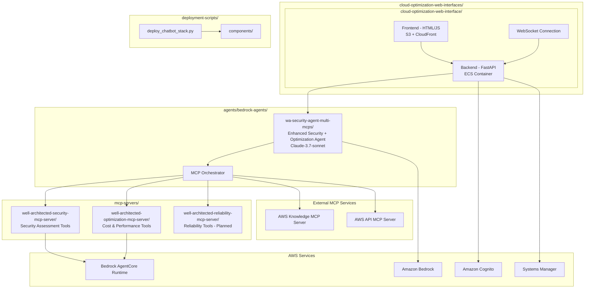
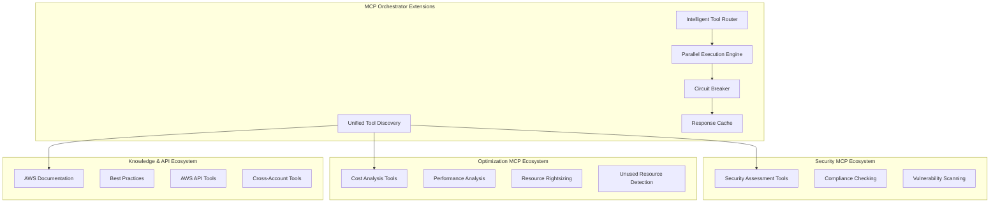

# Design Document

## Overview

This design implements a phased approach to cloud optimization capabilities, starting with the existing Enhanced Security Agent as the foundation. The first phase focuses exclusively on security assessment tools, while future phases will add configurable pillar selection and flexible LLM model support.

**Phase 1 (Current Implementation):**
- Security assessment agent with existing security MCP servers
- Fixed Claude-3.7-sonnet integration
- Proven multi-MCP orchestration pattern

**Future Phases:**
- Configurable pillar selection (Security, Cost Optimization, Reliability, Performance)
- Dynamic LLM model switching (Claude variants, other Bedrock models)
- Multi-pillar orchestration with user-selectable combinations

The design maintains architectural consistency with the current system using Amazon Cognito for authentication, ECS for hosting, S3/CloudFront for the frontend, and Bedrock AgentCore Runtime for MCP server deployment.

## Architecture

### High-Level Architecture Following Current Folder Structure



### Enhanced MCP Orchestration Architecture



## Components and Interfaces

### 1. Enhanced Agent Core (agents/bedrock-agents/wa-security-agent-multi-mcps/)

**Phase 1: Security Assessment Focus**
- Location: `agents/bedrock-agents/wa-security-agent-multi-mcps/agent_config/wa_security_agent.py`
- Maintains existing security assessment capabilities
- Uses current Claude-3.7-sonnet integration
- Focuses on security MCP servers only

**Future Phases: Configurable Agent Architecture**
```python
# Future extension to wa_security_agent.py
class ConfigurableCloudOptimizationAgent:
    def __init__(self, 
                 mcp_orchestrator: MCPOrchestrator,
                 enabled_pillars: List[WellArchitectedPillar],
                 llm_model_config: LLMModelConfig):
        self.enabled_pillars = enabled_pillars
        self.llm_model_config = llm_model_config
        self.mcp_orchestrator = mcp_orchestrator
        
        # Initialize engines based on enabled pillars
        if WellArchitectedPillar.SECURITY in enabled_pillars:
            self.security_engine = SecurityAssessmentEngine()
        if WellArchitectedPillar.COST_OPTIMIZATION in enabled_pillars:
            self.cost_engine = CostOptimizationEngine()
        if WellArchitectedPillar.RELIABILITY in enabled_pillars:
            self.reliability_engine = ReliabilityEngine()
    
    async def switch_llm_model(self, new_model_config: LLMModelConfig):
        # Dynamic model switching capability
        pass
    
    async def enable_pillar(self, pillar: WellArchitectedPillar):
        # Runtime pillar activation
        pass
```

**LLM Model Configuration Support:**
```python
@dataclass
class LLMModelConfig:
    model_id: str  # e.g., "anthropic.claude-3-5-sonnet-20241022-v2:0"
    model_provider: str  # "bedrock", "sagemaker", etc.
    model_parameters: Dict[str, Any]
    region: str = "us-east-1"
    
    # Supported models for future phases
    SUPPORTED_MODELS = {
        "claude-3-haiku": "anthropic.claude-3-haiku-20240307-v1:0",
        "claude-3-sonnet": "anthropic.claude-3-sonnet-20240229-v1:0", 
        "claude-3.5-sonnet": "anthropic.claude-3-5-sonnet-20241022-v2:0",
        "claude-3-opus": "anthropic.claude-3-opus-20240229-v1:0"
    }
```

### 2. MCP Server Ecosystem (mcp-servers/)

**Phase 1: Security Focus**
- **well-architected-security-mcp-server/** (existing)
  - Current 6 security assessment tools
  - Deployed to Bedrock AgentCore Runtime
  - Integrated with existing agent

**Future Phases: Pillar-Based MCP Servers**

**well-architected-cost-optimization-mcp-server/** (future)
- Location: `mcp-servers/well-architected-cost-optimization-mcp-server/`
- Structure mirrors existing security MCP server
- Cost analysis and optimization recommendations
- Resource rightsizing analysis
- Unused resource detection
- ROI calculations for optimization actions

**well-architected-reliability-mcp-server/** (future)
- Location: `mcp-servers/well-architected-reliability-mcp-server/`
- Reliability and resilience assessment tools
- Disaster recovery analysis
- Backup and monitoring evaluation

**well-architected-performance-mcp-server/** (future)
- Location: `mcp-servers/well-architected-performance-mcp-server/`
- Performance efficiency assessment tools
- Resource utilization analysis
- Performance bottleneck detection

**Configurable MCP Server Selection:**
```python
@dataclass
class MCPServerConfiguration:
    pillar: WellArchitectedPillar
    server_name: str
    enabled: bool
    deployment_target: str  # "agentcore" or "direct"
    
    # Configuration mapping for user selection
    PILLAR_MCP_MAPPING = {
        WellArchitectedPillar.SECURITY: "well-architected-security-mcp-server",
        WellArchitectedPillar.COST_OPTIMIZATION: "well-architected-cost-optimization-mcp-server",
        WellArchitectedPillar.RELIABILITY: "well-architected-reliability-mcp-server",
        WellArchitectedPillar.PERFORMANCE: "well-architected-performance-mcp-server",
        WellArchitectedPillar.OPERATIONAL_EXCELLENCE: "well-architected-operations-mcp-server"
    }
```

### 3. Enhanced MCP Orchestration (agents/bedrock-agents/wa-security-agent-multi-mcps/agent_config/orchestration/)

**Extended MCP Orchestrator** (extends existing mcp_orchestrator.py)
- Location: `agents/bedrock-agents/wa-security-agent-multi-mcps/agent_config/orchestration/mcp_orchestrator.py`
- Adds optimization MCP server connections alongside existing security, knowledge, and API servers
- Intelligent routing between security and optimization tools
- Unified tool discovery across all Well-Architected pillars

```python
# Extension to existing MCPOrchestratorImpl
class EnhancedMCPOrchestrator(MCPOrchestratorImpl):
    async def _initialize_optimization_connector(self) -> None:
        # Initialize Well-Architected Optimization MCP Server connector
        pass
    
    async def _initialize_reliability_connector(self) -> None:
        # Initialize Well-Architected Reliability MCP Server connector (planned)
        pass
    
    def route_optimization_request(self, request: str, context: Dict) -> List[ToolCall]:
        # Routes to appropriate MCP servers based on request intent
        pass
```

### 4. Enhanced Web Interface (cloud-optimization-web-interfaces/cloud-optimization-web-interface/)

**Phase 1: Security Assessment Interface**
- Location: `cloud-optimization-web-interfaces/cloud-optimization-web-interface/backend/main.py`
- Maintains existing security assessment endpoints
- Uses current LLM Orchestrator Service integration
- Focuses on security-only workflows

**Future Phases: Configurable Multi-Pillar Interface**

**Backend Extensions:**
```python
# Future extension to main.py
@app.post("/api/configure-pillars")
async def configure_enabled_pillars(
    pillars: List[WellArchitectedPillar], 
    user=Depends(get_current_user)
):
    # Configure which pillars are enabled for user session
    pass

@app.post("/api/configure-llm-model") 
async def configure_llm_model(
    model_config: LLMModelConfig,
    user=Depends(get_current_user)
):
    # Switch LLM model for user session
    pass

@app.get("/api/available-models")
async def get_available_models():
    # Return list of supported LLM models
    pass
```

**Frontend Extensions:**
- Pillar selection interface (checkboxes for Security, Cost, Reliability, etc.)
- LLM model selection dropdown
- Dynamic dashboard based on enabled pillars
- Configuration persistence per user session

### 5. Enhanced Deployment Scripts (deployment-scripts/)

**New Component Deployment Scripts:**
- `components/deploy_component_wa_optimization_mcp.py` - Deploy optimization MCP server
- `components/deploy_component_wa_reliability_mcp.py` - Deploy reliability MCP server (planned)
- Extensions to existing `deploy_bedrockagent_wa_security_agent.py` for multi-pillar support

**Enhanced Main Deployment:**
- Extensions to `deploy_chatbot_stack.py` for optimization components
- Updates to `deploy-coa.sh` script for new MCP servers
- Enhanced cross-account role generation for optimization permissions

## Data Models

### Core Data Structures

```python
@dataclass
class OptimizationRecommendation:
    id: str
    category: OptimizationCategory  # COST, PERFORMANCE, SECURITY, GOVERNANCE
    priority: Priority  # HIGH, MEDIUM, LOW
    resource_arn: str
    current_state: Dict[str, Any]
    recommended_state: Dict[str, Any]
    estimated_savings: Optional[CostSavings]
    security_impact: SecurityImpact
    implementation_effort: ImplementationEffort
    roi_analysis: ROIAnalysis
    compliance_alignment: List[ComplianceFramework]

@dataclass
class UnifiedAssessment:
    assessment_id: str
    timestamp: datetime
    scope: AssessmentScope
    security_findings: List[SecurityFinding]
    optimization_recommendations: List[OptimizationRecommendation]
    executive_summary: ExecutiveSummary
    action_plan: ActionPlan
    cost_impact: CostImpactAnalysis

@dataclass
class CostSavings:
    monthly_savings: Decimal
    annual_savings: Decimal
    implementation_cost: Decimal
    payback_period_months: int
    confidence_level: float

@dataclass
class ROIAnalysis:
    initial_investment: Decimal
    annual_savings: Decimal
    roi_percentage: float
    break_even_months: int
    net_present_value: Decimal
```

### MCP Tool Extensions

```python
@dataclass
class OptimizationTool(Tool):
    optimization_category: OptimizationCategory
    cost_impact_level: CostImpactLevel
    security_considerations: List[SecurityConsideration]
    cross_account_capable: bool
    estimated_execution_cost: Optional[Decimal]
```

## Error Handling

### Enhanced Error Recovery

**OptimizationErrorHandler** (extends existing error handling)
```python
class OptimizationErrorHandler:
    async def handle_cost_analysis_error(self, error: CostAnalysisError) -> FallbackResponse:
        # Provides alternative cost estimation methods
        # Falls back to qualitative analysis when quantitative fails
        pass
    
    async def handle_cross_account_error(self, error: CrossAccountError) -> RecoveryAction:
        # Provides clear guidance for permission issues
        # Suggests alternative approaches for inaccessible accounts
        pass
    
    def generate_degraded_response(self, available_data: Dict) -> DegradedResponse:
        # Provides best-effort analysis with available data
        # Clearly indicates limitations and missing information
        pass
```

### Circuit Breaker Patterns for Optimization Services

- **Cost Analysis Circuit Breaker**: Prevents cascading failures in cost calculation services
- **Performance Analysis Circuit Breaker**: Handles timeouts in resource utilization analysis
- **Cross-Account Circuit Breaker**: Manages failures in multi-account operations

## Testing Strategy

### Unit Testing

**Security + Optimization Integration Tests**
```python
class TestUnifiedAssessment:
    async def test_security_optimization_conflict_resolution(self):
        # Tests handling of conflicting security and cost recommendations
        pass
    
    async def test_cross_account_optimization_analysis(self):
        # Tests multi-account optimization capabilities
        pass
    
    async def test_roi_calculation_accuracy(self):
        # Tests cost savings and ROI calculation logic
        pass
```

### Integration Testing

**MCP Server Integration Tests**
- Test communication between existing security MCP and new optimization MCP
- Validate tool discovery across extended MCP ecosystem
- Test parallel execution of security and optimization tools
- Validate cross-account role assumption and data aggregation

### End-to-End Testing

**User Journey Tests**
- Complete security + optimization assessment workflow
- Multi-account analysis scenarios
- Cost optimization recommendation implementation
- Executive reporting and audit trail validation

### Performance Testing

**Scalability Tests**
- Multi-account analysis performance (10+ accounts)
- Concurrent user sessions with mixed security/optimization requests
- Large-scale resource analysis (1000+ resources per account)
- MCP server load balancing and failover scenarios

### Security Testing

**Enhanced Security Validation**
- Cross-account role assumption security
- Sensitive cost data protection
- Audit trail completeness and integrity
- Permission boundary validation for optimization actions

## Implementation Considerations

### Folder Structure Alignment

**Following Current Architecture Pattern:**
```
/
├── cloud-optimization-web-interfaces/
│   └── cloud-optimization-web-interface/
│       ├── backend/                    # Extended FastAPI backend
│       ├── frontend/                   # Enhanced UI with optimization features
│       └── tests/                      # Integration tests for optimization
│
├── agents/bedrock-agents/
│   └── wa-security-agent-multi-mcps/   # Enhanced to include optimization
│       ├── agent_config/
│       │   ├── wa_security_agent.py    # Extended for optimization
│       │   ├── orchestration/          # Enhanced MCP orchestration
│       │   └── integrations/           # New optimization integrations
│       └── tests/                      # Extended test suite
│
├── mcp-servers/
│   ├── well-architected-security-mcp-server/      # Existing
│   ├── well-architected-optimization-mcp-server/  # New
│   └── well-architected-reliability-mcp-server/   # Planned
│
└── deployment-scripts/
    ├── components/
    │   ├── deploy_component_wa_optimization_mcp.py # New
    │   └── deploy_component_wa_reliability_mcp.py  # Planned
    ├── deploy_chatbot_stack.py        # Enhanced for optimization
    └── deploy-coa.sh                  # Updated deployment script
```

### Backward Compatibility

- Maintains existing security assessment APIs and interfaces
- Preserves current authentication and authorization mechanisms  
- Ensures existing security workflows continue to function
- Provides migration path for existing configurations
- Follows established MCP server patterns and interfaces

### Configuration Management (Systems Manager Parameter Store)

**Phase 1: Security-Only Configuration:**
```
/coa/
├── cognito/                           # Existing Cognito configuration
├── components/
│   └── wa-security-mcp/              # Existing security MCP config
├── agent/
│   └── enhanced-security-agent-id    # Existing agent configuration
└── deployment/                       # Existing deployment configuration
```

**Future Phases: Multi-Pillar Configuration:**
```
/coa/
├── cognito/                           # Existing Cognito configuration
├── components/
│   ├── wa-security-mcp/              # Security MCP config
│   ├── wa-cost-optimization-mcp/     # Cost optimization MCP config
│   ├── wa-reliability-mcp/           # Reliability MCP config
│   └── wa-performance-mcp/           # Performance MCP config
├── agent/
│   ├── enhanced-security-agent-id    # Agent configuration
│   ├── available-pillars             # List of available pillars
│   ├── available-llm-models          # List of supported LLM models
│   └── default-pillar-config         # Default pillar selection
├── user-preferences/                  # User-specific configurations
│   ├── {user-id}/enabled-pillars     # Per-user pillar selection
│   └── {user-id}/preferred-llm-model # Per-user LLM model preference
└── deployment/                       # Deployment configuration
```

**Configuration Data Models:**
```python
@dataclass
class WellArchitectedPillar(Enum):
    SECURITY = "security"
    COST_OPTIMIZATION = "cost_optimization" 
    RELIABILITY = "reliability"
    PERFORMANCE_EFFICIENCY = "performance_efficiency"
    OPERATIONAL_EXCELLENCE = "operational_excellence"

@dataclass
class UserConfiguration:
    user_id: str
    enabled_pillars: List[WellArchitectedPillar]
    preferred_llm_model: str
    session_preferences: Dict[str, Any]
    
@dataclass
class SystemConfiguration:
    available_pillars: List[WellArchitectedPillar]
    available_llm_models: List[str]
    default_pillar_selection: List[WellArchitectedPillar]
    default_llm_model: str
```

### Monitoring and Observability

**Enhanced Metrics**
- Optimization recommendation accuracy tracking
- Cost savings realization monitoring
- Cross-account analysis performance metrics
- User adoption of optimization vs security features
- ROI calculation accuracy validation

### Deployment Strategy

**Phased Implementation Approach**

**Phase 1: Security Assessment Foundation (Current)**
- Deploy existing security agent and security MCP server
- Fixed Claude-3.7-sonnet integration
- Single-pillar (security) assessment capability
- Proven architecture and deployment patterns

**Phase 2: Configurable Architecture (Future)**
- Add pillar selection configuration to web interface
- Implement LLM model switching capability
- Deploy additional MCP servers (cost optimization, reliability)
- User-configurable pillar combinations

**Phase 3: Multi-Pillar Integration (Future)**
- Full multi-pillar orchestration
- Cross-pillar analysis and recommendations
- Advanced reporting with pillar correlation
- Executive dashboards with business impact analysis

**Phase 4: Advanced Features (Future)**
- Automated remediation actions
- Multi-account analysis across pillars
- Custom assessment templates
- Integration with AWS Config Rules and Systems Manager

### Data Protection and Compliance

**Enhanced Data Handling**
- Cost data encryption in transit and at rest
- Audit logging for all optimization recommendations and actions
- Data retention policies for cost analysis historical data
- Cross-account data access controls and monitoring
- Compliance with financial data handling requirements