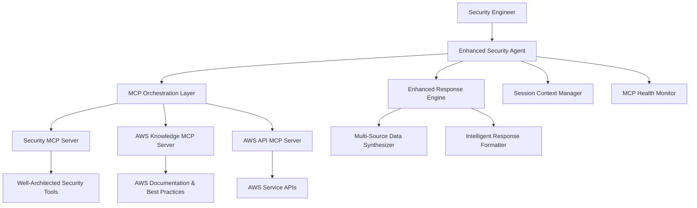
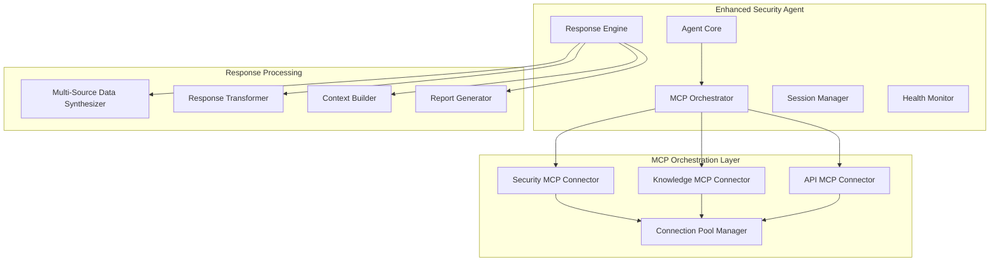

# Design Document

## Overview

The Enhanced Security Agent with Multi-MCP Integration represents a significant evolution of the existing AWS Security Assessment Agent. This design creates a comprehensive security advisor that combines real-time AWS security data, authoritative AWS documentation, and direct AWS API access to provide the most intelligent and actionable security guidance possible.

The enhanced agent will orchestrate three MCP servers:
1. **Well-Architected Security MCP Server** - Real-time security assessments
2. **AWS Knowledge MCP Server** - Official AWS documentation and best practices
3. **AWS API MCP Server** - Direct AWS service interactions and detailed resource analysis

## Architecture

### High-Level Architecture



### Component Architecture



## Components and Interfaces

### 1. Enhanced Security Agent Core

**Purpose**: Main agent class that extends the existing SecurityAgent with multi-MCP capabilities.

**Key Interfaces**:
```python
class EnhancedSecurityAgent(Agent):
    async def stream(self, user_query: str) -> AsyncGenerator[str, None]
    async def health_check(self) -> Dict[str, Any]
    def get_available_tools(self) -> Dict[str, List[Dict[str, Any]]]
    async def generate_comprehensive_report(self) -> str
    async def execute_enhanced_workflow(self, workflow_type: str, parameters: Dict) -> str
```

**Responsibilities**:
- Coordinate multi-MCP server interactions
- Manage session context and conversation history
- Provide unified interface for security assessments
- Handle error recovery and graceful degradation

### 2. MCP Orchestration Layer

**Purpose**: Manages connections and interactions with multiple MCP servers.

**Key Interfaces**:
```python
class MCPOrchestrator:
    async def initialize_connections(self) -> None
    async def execute_parallel_calls(self, tool_calls: List[ToolCall]) -> List[ToolResult]
    async def call_security_tool(self, tool_name: str, args: Dict) -> Optional[str]
    async def call_knowledge_tool(self, tool_name: str, args: Dict) -> Optional[str]
    async def call_api_tool(self, tool_name: str, args: Dict) -> Optional[str]
    async def discover_all_tools(self) -> Dict[str, List[Tool]]
```

**Responsibilities**:
- Maintain connections to all MCP servers
- Execute tool calls in parallel when possible
- Handle authentication and connection management
- Provide unified tool discovery across all servers

### 3. Multi-Source Data Synthesizer

**Purpose**: Intelligently combines data from multiple MCP servers into coherent insights.

**Key Interfaces**:
```python
class MultiSourceDataSynthesizer:
    def synthesize_security_assessment(self, 
                                     security_data: Dict, 
                                     knowledge_data: Dict, 
                                     api_data: Dict) -> SynthesizedResult
    def resolve_conflicts(self, conflicting_data: List[DataSource]) -> ResolvedData
    def prioritize_recommendations(self, recommendations: List[Recommendation]) -> List[Recommendation]
    def generate_executive_summary(self, all_data: Dict) -> ExecutiveSummary
```

**Responsibilities**:
- Combine data from multiple sources intelligently
- Resolve conflicts between different data sources
- Prioritize recommendations based on risk and impact
- Generate executive summaries for stakeholders

### 4. Enhanced Response Engine

**Purpose**: Transforms raw MCP data into intelligent, actionable responses.

**Key Interfaces**:
```python
class EnhancedResponseEngine:
    def transform_multi_source_response(self, 
                                      tool_results: List[ToolResult], 
                                      user_query: str) -> str
    def create_contextual_analysis(self, current_data: Dict, session_context: Dict) -> str
    def generate_action_plan(self, findings: List[Finding]) -> ActionPlan
    def format_with_documentation_links(self, response: str, docs: List[Document]) -> str
```

**Responsibilities**:
- Transform raw data into human-readable insights
- Add contextual analysis based on session history
- Generate actionable recommendations with implementation steps
- Include relevant documentation links and references

### 5. AWS Knowledge Integration Module

**Purpose**: Specialized handler for AWS Knowledge MCP Server interactions.

**Key Interfaces**:
```python
class AWSKnowledgeIntegration:
    async def search_relevant_documentation(self, security_topic: str) -> List[Document]
    async def get_best_practices_for_service(self, aws_service: str) -> BestPractices
    async def find_compliance_guidance(self, compliance_framework: str) -> ComplianceGuide
    def format_documentation_results(self, docs: List[Document]) -> str
```

**Responsibilities**:
- Search AWS documentation for relevant security guidance
- Retrieve service-specific best practices
- Find compliance and regulatory guidance
- Format documentation results for integration with security assessments

### 6. AWS API Integration Module

**Purpose**: Specialized handler for AWS API MCP Server interactions.

**Key Interfaces**:
```python
class AWSAPIIntegration:
    async def get_detailed_resource_config(self, resource_arn: str) -> ResourceConfig
    async def analyze_service_configuration(self, service_name: str, region: str) -> ServiceAnalysis
    async def execute_remediation_action(self, action: RemediationAction) -> ActionResult
    async def validate_permissions(self, required_permissions: List[str]) -> PermissionStatus
```

**Responsibilities**:
- Gather detailed resource configurations through AWS APIs
- Perform deep service configuration analysis
- Execute automated remediation actions when requested
- Validate required permissions for API operations

### 7. Session Context Manager

**Purpose**: Maintains conversation context and builds intelligence over time.

**Key Interfaces**:
```python
class SessionContextManager:
    def add_assessment_result(self, result: AssessmentResult) -> None
    def get_session_insights(self) -> SessionInsights
    def build_contextual_recommendations(self, current_query: str) -> List[Recommendation]
    def track_remediation_progress(self, actions: List[Action]) -> ProgressReport
```

**Responsibilities**:
- Store and manage session conversation history
- Build contextual understanding over time
- Track remediation progress across sessions
- Provide insights based on historical assessments

## Data Models

### Core Data Models

```python
@dataclass
class ToolCall:
    tool_name: str
    mcp_server: str
    arguments: Dict[str, Any]
    priority: int = 0

@dataclass
class ToolResult:
    tool_name: str
    mcp_server: str
    success: bool
    data: Any
    error_message: Optional[str] = None
    execution_time: float = 0.0

@dataclass
class SynthesizedResult:
    primary_findings: List[Finding]
    supporting_documentation: List[Document]
    api_insights: List[APIInsight]
    recommendations: List[Recommendation]
    executive_summary: str
    confidence_score: float

@dataclass
class Finding:
    id: str
    severity: str
    title: str
    description: str
    affected_resources: List[str]
    remediation_steps: List[str]
    documentation_links: List[str]
    api_remediation_available: bool

@dataclass
class Recommendation:
    id: str
    priority: str
    category: str
    title: str
    description: str
    implementation_steps: List[str]
    documentation_references: List[str]
    estimated_effort: str
    business_impact: str
```

### MCP Server Configuration Models

```python
@dataclass
class MCPServerConfig:
    name: str
    type: str  # 'agentcore', 'direct', 'api'
    url: Optional[str]
    headers: Optional[Dict[str, str]]
    authentication: AuthConfig
    timeout: int = 120
    retry_config: RetryConfig
    health_check_interval: int = 300

@dataclass
class AuthConfig:
    type: str  # 'bearer', 'aws_iam', 'api_key'
    credentials: Dict[str, str]
    refresh_mechanism: Optional[str]

@dataclass
class RetryConfig:
    max_attempts: int = 3
    backoff_factor: float = 2.0
    max_delay: int = 60
```

## Error Handling

### Error Handling Strategy

1. **Graceful Degradation**: When one MCP server fails, continue with available servers
2. **Intelligent Retry**: Implement exponential backoff with jitter for transient failures
3. **User Communication**: Clearly communicate limitations when services are unavailable
4. **Fallback Mechanisms**: Provide alternative approaches when primary methods fail

### Error Categories and Responses

```python
class ErrorHandler:
    def handle_mcp_connection_error(self, server_name: str, error: Exception) -> ErrorResponse
    def handle_authentication_error(self, server_name: str, error: Exception) -> ErrorResponse
    def handle_rate_limit_error(self, server_name: str, error: Exception) -> ErrorResponse
    def handle_timeout_error(self, server_name: str, error: Exception) -> ErrorResponse
    def handle_permission_error(self, server_name: str, error: Exception) -> ErrorResponse
```

### Error Recovery Patterns

1. **Circuit Breaker**: Temporarily disable failing MCP servers
2. **Bulkhead**: Isolate failures to prevent cascade effects
3. **Timeout Management**: Prevent hanging requests from blocking the agent
4. **Health Monitoring**: Continuously monitor MCP server health

## Testing Strategy

### Unit Testing

- **MCP Connector Tests**: Mock MCP server responses and test connection handling
- **Data Synthesizer Tests**: Test data combination logic with various input scenarios
- **Response Engine Tests**: Verify response formatting and transformation logic
- **Error Handler Tests**: Test all error scenarios and recovery mechanisms

### Integration Testing

- **Multi-MCP Workflows**: Test complete workflows using all three MCP servers
- **Authentication Tests**: Verify authentication mechanisms for each MCP server
- **Performance Tests**: Measure response times with parallel MCP server calls
- **Resilience Tests**: Test behavior when MCP servers are unavailable

### End-to-End Testing

- **Security Assessment Workflows**: Complete security assessment scenarios
- **Documentation Integration**: Verify AWS documentation is properly integrated
- **API Remediation**: Test automated remediation through AWS APIs
- **Session Context**: Test context building across multiple interactions

### Test Data and Mocking

```python
class MCPServerMock:
    def mock_security_server_responses(self) -> Dict[str, Any]
    def mock_knowledge_server_responses(self) -> Dict[str, Any]
    def mock_api_server_responses(self) -> Dict[str, Any]
    def simulate_server_failures(self, failure_type: str) -> None
```

## Performance Considerations

### Optimization Strategies

1. **Parallel Execution**: Execute MCP server calls in parallel when possible
2. **Intelligent Caching**: Cache frequently requested documentation and API responses
3. **Request Batching**: Batch similar requests to reduce overhead
4. **Progressive Loading**: Stream results as they become available
5. **Connection Pooling**: Reuse connections to MCP servers

### Performance Metrics

- **Response Time**: Total time from query to complete response
- **MCP Server Latency**: Individual MCP server response times
- **Cache Hit Rate**: Effectiveness of caching mechanisms
- **Parallel Execution Efficiency**: Time savings from parallel processing
- **Error Rate**: Frequency of MCP server errors and timeouts

### Scalability Design

```python
class PerformanceManager:
    def monitor_response_times(self) -> Dict[str, float]
    def manage_connection_pool(self) -> None
    def implement_request_queuing(self) -> None
    def optimize_parallel_execution(self, tool_calls: List[ToolCall]) -> List[ToolCall]
```

## Security Considerations

### Authentication and Authorization

- **Secure Credential Storage**: Use AWS Secrets Manager for MCP server credentials
- **IAM Role-Based Access**: Implement least-privilege access for AWS API calls
- **Token Refresh**: Automatic refresh of authentication tokens
- **Audit Logging**: Log all MCP server interactions for security auditing

### Data Protection

- **Encryption in Transit**: All MCP server communications use HTTPS/TLS
- **Sensitive Data Handling**: Mask sensitive information in logs and responses
- **Data Retention**: Implement appropriate data retention policies for session data
- **Access Controls**: Restrict access to MCP server configurations and credentials

### Security Monitoring

```python
class SecurityMonitor:
    def log_mcp_interactions(self, interaction: MCPInteraction) -> None
    def detect_anomalous_behavior(self, patterns: List[Pattern]) -> List[Alert]
    def validate_response_integrity(self, response: MCPResponse) -> bool
    def monitor_credential_usage(self) -> CredentialUsageReport
```

## Deployment Architecture

### Infrastructure Components

1. **Enhanced Agent Runtime**: Updated Bedrock Agent with multi-MCP capabilities
2. **MCP Server Configurations**: Secure storage of connection details and credentials
3. **Monitoring and Logging**: CloudWatch integration for health monitoring
4. **Auto-scaling**: Support for multiple agent instances if needed

### Deployment Pipeline


### Configuration Management

- **Environment-Specific Configs**: Different MCP server endpoints per environment
- **Credential Rotation**: Automated credential rotation for security
- **Feature Flags**: Enable/disable specific MCP server integrations
- **Health Checks**: Automated health monitoring and alerting

This design provides a comprehensive foundation for creating an enhanced security agent that leverages multiple MCP servers to provide the most intelligent and actionable security guidance possible.