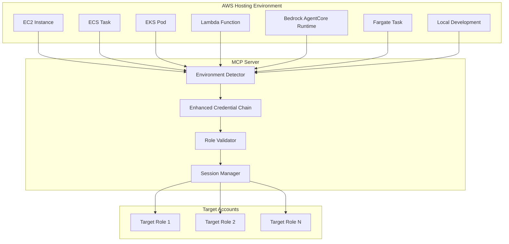
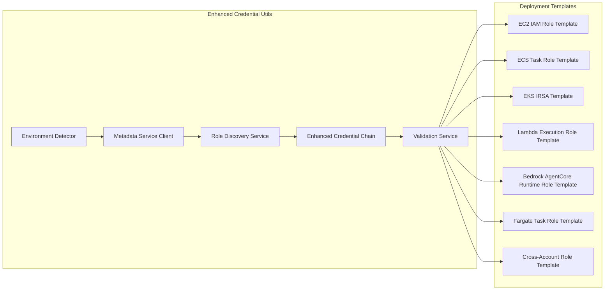

# Design Document

## Overview

This design enhances the existing MCP AssumeRole functionality to seamlessly integrate with AWS's native credential chain and IAM roles for services across all AWS compute platforms. The system will automatically detect the hosting environment (EC2, ECS, EKS, Lambda, Bedrock AgentCore Runtime, Fargate, etc.) and leverage the associated IAM role for cross-account operations, eliminating the need for manual credential management while maintaining security best practices.

The design builds upon the existing `credential_utils.py` module and extends it with environment detection, automatic role discovery, and enhanced validation capabilities. This approach follows AWS security best practices by using temporary credentials and avoiding credential exposure.

## Architecture

### High-Level Architecture



### Component Architecture



## Components and Interfaces

### 1. Environment Detection Service

**Purpose**: Automatically detect the AWS hosting environment and retrieve the associated IAM role.

**Interface**:
```python
class EnvironmentDetector:
    def detect_environment() -> EnvironmentInfo
    def get_hosting_role_arn() -> Optional[str]
    def get_metadata_service_info() -> Dict[str, Any]
    def validate_environment() -> ValidationResult
```

**Key Methods**:
- `detect_environment()`: Identifies EC2, ECS, Lambda, or local environment
- `get_hosting_role_arn()`: Retrieves the IAM role ARN from metadata service
- `get_metadata_service_info()`: Gets additional environment metadata
- `validate_environment()`: Ensures the environment is properly configured

### 2. Enhanced Credential Chain

**Purpose**: Extends the existing credential chain to automatically use hosting environment credentials.

**Interface**:
```python
class EnhancedCredentialChain:
    def create_session() -> boto3.Session
    def get_source_role_arn() -> Optional[str]
    def validate_source_permissions() -> ValidationResult
    def refresh_credentials() -> bool
```

**Key Methods**:
- `create_session()`: Creates session using environment-appropriate credentials
- `get_source_role_arn()`: Returns the source role ARN for trust policies
- `validate_source_permissions()`: Checks if source role can assume target roles
- `refresh_credentials()`: Handles automatic credential refresh

### 3. Cross-Account Role Manager

**Purpose**: Manages cross-account role configurations and deployments.

**Interface**:
```python
class CrossAccountRoleManager:
    def generate_trust_policy(source_role_arn: str, external_id: Optional[str]) -> Dict
    def create_deployment_template(target_account: str, role_name: str) -> str
    def validate_cross_account_access(target_role_arn: str) -> ValidationResult
    def discover_assumable_roles() -> List[RoleInfo]
```

**Key Methods**:
- `generate_trust_policy()`: Creates trust policy for cross-account access
- `create_deployment_template()`: Generates CloudFormation template for target account
- `validate_cross_account_access()`: Tests if cross-account assumption works
- `discover_assumable_roles()`: Finds all configured assumable roles

### 4. Deployment Template Generator

**Purpose**: Generates CloudFormation templates for hosting environment IAM roles.

**Interface**:
```python
class DeploymentTemplateGenerator:
    def generate_ec2_role_template() -> str
    def generate_ecs_task_role_template() -> str
    def generate_eks_irsa_template() -> str
    def generate_lambda_execution_role_template() -> str
    def generate_bedrock_agentcore_runtime_role_template() -> str
    def generate_fargate_task_role_template() -> str
    def generate_cross_account_role_template(source_role_arn: str) -> str
```

**Key Methods**:
- `generate_ec2_role_template()`: Creates EC2 instance role with MCP permissions
- `generate_ecs_task_role_template()`: Creates ECS task role with MCP permissions
- `generate_eks_irsa_template()`: Creates EKS IRSA configuration with service account and role
- `generate_lambda_execution_role_template()`: Creates Lambda role with MCP permissions
- `generate_bedrock_agentcore_runtime_role_template()`: Creates Bedrock AgentCore runtime role
- `generate_fargate_task_role_template()`: Creates Fargate task role with MCP permissions
- `generate_cross_account_role_template()`: Creates assumable role for target accounts

## Data Models

### Environment Information
```python
@dataclass
class EnvironmentInfo:
    environment_type: str  # 'ec2', 'ecs', 'eks', 'lambda', 'bedrock-agentcore', 'fargate', 'local'
    role_arn: Optional[str]
    instance_id: Optional[str]
    task_arn: Optional[str]
    pod_name: Optional[str]
    service_account: Optional[str]
    function_name: Optional[str]
    runtime_id: Optional[str]
    region: str
    account_id: str
    metadata: Dict[str, Any]
```

### Role Configuration
```python
@dataclass
class RoleConfiguration:
    role_arn: str
    external_id: Optional[str]
    session_name: str
    target_account: str
    permissions: List[str]
    trust_policy: Dict[str, Any]
```

### Validation Result
```python
@dataclass
class ValidationResult:
    is_valid: bool
    errors: List[str]
    warnings: List[str]
    recommendations: List[str]
    details: Dict[str, Any]
```

## Error Handling

### Error Categories

1. **Environment Detection Errors**
   - Metadata service unavailable
   - No IAM role attached to hosting resource
   - Invalid environment configuration

2. **Permission Errors**
   - Source role lacks sts:AssumeRole permission
   - Target role trust policy doesn't allow source role
   - External ID mismatch

3. **Configuration Errors**
   - Invalid role ARN format
   - Missing required environment variables
   - Conflicting credential sources

### Error Handling Strategy

```python
class MCPCredentialError(Exception):
    """Base exception for MCP credential-related errors"""
    pass

class EnvironmentDetectionError(MCPCredentialError):
    """Raised when environment detection fails"""
    pass

class PermissionValidationError(MCPCredentialError):
    """Raised when permission validation fails"""
    pass

class CrossAccountAccessError(MCPCredentialError):
    """Raised when cross-account access fails"""
    pass
```

### Error Recovery

1. **Graceful Degradation**: Fall back to default credential chain if environment detection fails
2. **Detailed Logging**: Provide comprehensive error messages with remediation steps
3. **Validation Tools**: Include diagnostic tools to help troubleshoot configuration issues
4. **Documentation**: Provide clear setup guides for each hosting environment

## Testing Strategy

### Unit Tests

1. **Environment Detection Tests**
   - Mock metadata service responses for different environments
   - Test error handling when metadata service is unavailable
   - Validate role ARN extraction from different response formats

2. **Credential Chain Tests**
   - Test session creation with different credential sources
   - Validate AssumeRole operations with various configurations
   - Test credential refresh mechanisms

3. **Template Generation Tests**
   - Validate generated CloudFormation templates
   - Test template customization with different parameters
   - Ensure generated policies follow least privilege principles

### Integration Tests

1. **Cross-Account Access Tests**
   - Test actual AssumeRole operations between accounts
   - Validate permission inheritance and scoping
   - Test external ID validation

2. **Environment-Specific Tests**
   - Test on actual EC2 instances with instance profiles
   - Test in ECS tasks with task roles
   - Test in Lambda functions with execution roles

3. **End-to-End Tests**
   - Deploy MCP server in different environments
   - Test cross-account security assessments
   - Validate logging and monitoring capabilities

### Performance Tests

1. **Credential Refresh Performance**
   - Test credential refresh latency
   - Validate session reuse efficiency
   - Test concurrent access patterns

2. **Environment Detection Performance**
   - Measure metadata service response times
   - Test caching effectiveness
   - Validate startup time impact

## Security Considerations

### Principle of Least Privilege

1. **Hosting Role Permissions**
   - Grant only minimum required permissions for MCP operations
   - Use resource-specific ARNs where possible
   - Implement condition-based access controls

2. **Cross-Account Role Permissions**
   - Limit permissions to read-only security assessment operations
   - Use external IDs for enhanced security
   - Implement time-based access conditions where appropriate

### Credential Security

1. **No Credential Exposure**
   - Never log or expose temporary credentials
   - Use secure credential refresh mechanisms
   - Implement proper credential cleanup

2. **Session Management**
   - Use short-lived sessions where possible
   - Implement proper session invalidation
   - Monitor for unusual access patterns

### Audit and Monitoring

1. **CloudTrail Integration**
   - Log all AssumeRole operations
   - Track cross-account access patterns
   - Monitor for permission escalation attempts

2. **Metrics and Alerting**
   - Track credential refresh failures
   - Monitor cross-account access success rates
   - Alert on unusual access patterns

## Implementation Plan

### Phase 1: Environment Detection Enhancement
- Extend `credential_utils.py` with environment detection
- Add metadata service clients for EC2, ECS, and Lambda
- Implement role ARN discovery and validation

### Phase 2: Enhanced Credential Chain
- Modify `create_aws_session()` to use environment-detected credentials
- Add automatic role discovery and validation
- Implement credential refresh mechanisms

### Phase 3: Template Generation
- Create CloudFormation template generators for hosting roles
- Generate cross-account role templates with proper trust policies
- Add template validation and testing

### Phase 4: Integration and Testing
- Integrate with existing MCP server functionality
- Add comprehensive test coverage
- Create deployment documentation and examples

### Phase 5: Documentation and Examples
- Update existing documentation with new capabilities
- Create environment-specific setup guides
- Add troubleshooting and diagnostic tools