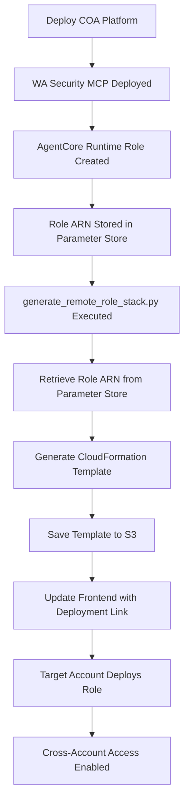

# Cross-Account Role Setup Guide

## Overview

The Cloud Optimization Assistant platform supports cross-account security analysis through read-only IAM roles deployed in target AWS accounts. This guide explains how to set up and deploy these roles to enable secure, cross-account access for MCP servers and Bedrock agents.

## ⚠️ Security Disclaimer

**IMPORTANT SECURITY NOTICE:**

- **Read-Only Access**: All cross-account roles are strictly designed as **read-only** to prevent any modifications to target AWS accounts
- **Data Privacy Protection**: The roles **DO NOT** include `GetObject`-like actions that could access actual data content, protecting data privacy
- **No Destructive Operations**: Roles cannot create, modify, or delete resources in target accounts
- **Security Analysis Only**: Permissions are limited to metadata and configuration analysis for security assessment purposes
- **Audit Trail**: All cross-account access is logged through CloudTrail for compliance and monitoring

The read-only design ensures that while the Cloud Optimization Assistant can analyze your AWS environment for security recommendations, it cannot access sensitive data or make changes to your infrastructure.

## Purpose and Use Cases

### Why Cross-Account Access?

The Cloud Optimization Assistant uses MCP (Model Context Protocol) servers to call AWS API endpoints for comprehensive security analysis. Cross-account roles enable:

1. **Multi-Account Security Assessment**: Analyze security posture across multiple AWS accounts
2. **Centralized Compliance Monitoring**: Monitor compliance across your AWS organization
3. **Resource Discovery**: Identify resources and configurations across accounts
4. **Security Service Integration**: Access GuardDuty, Security Hub, Inspector findings across accounts
5. **Well-Architected Reviews**: Perform security pillar assessments across your infrastructure

### MCP Server Integration

MCP servers require cross-account access to:
- Fetch security service findings from GuardDuty, Security Hub, Inspector
- Analyze resource configurations for security best practices
- Generate comprehensive security reports across multiple accounts
- Provide recommendations based on multi-account visibility

## Remote Role Generation Script

### Purpose of `generate_remote_role_stack.py`

The `deployment-scripts/generate_remote_role_stack.py` script automates the creation of CloudFormation templates for deploying cross-account IAM roles. This script:

1. **Retrieves Configuration**: Automatically discovers the AgentCore Runtime Role ARN from Parameter Store
2. **Generates Templates**: Creates CloudFormation templates with appropriate trust policies and permissions
3. **Ensures Security**: Implements least-privilege access with read-only permissions only
4. **Provides Flexibility**: Supports customization through command-line parameters
5. **Integrates Seamlessly**: Works with the existing deployment workflow

### How It Works



## Deployment Process

### Step 1: Deploy the Main Platform

First, deploy the Cloud Optimization Assistant platform:

```bash
# Deploy the complete platform
./deploy-coa.sh --stack-name cloud-optimization-assistant --region us-east-1 --environment prod

# Or resume from a specific stage if needed
./deploy-coa.sh --resume-from-stage 5
```

The deployment automatically:
1. Creates the AgentCore Runtime Role
2. Stores configuration in Parameter Store
3. Generates the remote role CloudFormation template
4. Uploads the template to S3
5. Updates the frontend with the deployment link

### Step 2: Access the Deployment Link

After successful deployment, access the web interface and look for the remote role deployment section:

```
🔗 Cross-Account Role Deployment
Click here to deploy a ReadOnly IAM Role in target AWS accounts to allow
Cloud Optimization Assistant to scan your infrastructure for security analysis.
```

### Step 3: Deploy to Target Accounts

Click the deployment link to open the AWS CloudFormation console with pre-configured parameters:

1. **Review Template**: The template includes read-only permissions only
2. **Configure Parameters**:
   - Stack Name: `remote-mcp-readonly-role` (or customize)
   - Role Name: `CrossAccountMCPRole` (or customize)
   - Environment: Select appropriate environment tag
3. **Deploy Stack**: Click "Create Stack" to deploy the role

### Step 4: Verify Deployment

After deployment, verify the role was created successfully:

```bash
# Check the deployed role
aws iam get-role --role-name CrossAccountMCPRole --profile target-account

# Verify role permissions
aws iam list-attached-role-policies --role-name CrossAccountMCPRole --profile target-account
```

## Manual Template Generation

If you need to generate templates manually or customize the deployment:

### Basic Usage

```bash
# Navigate to deployment scripts directory
cd deployment-scripts

# Generate template with default settings
python3 generate_remote_role_stack.py

# Generate with custom role name
python3 generate_remote_role_stack.py --role-name MySecurityRole

# Generate with external ID for additional security
python3 generate_remote_role_stack.py --role-name MySecurityRole --external-id my-unique-external-id

# Generate for specific environment
python3 generate_remote_role_stack.py --environment staging
```

### Advanced Configuration

```bash
# Add additional managed policies
python3 generate_remote_role_stack.py \
  --additional-policies arn:aws:iam::aws:policy/job-function/ViewOnlyAccess

# Specify custom output directory
python3 generate_remote_role_stack.py \
  --output-dir ./custom-templates \
  --role-name CustomRole

# Enable verbose logging
python3 generate_remote_role_stack.py --verbose
```

### Generated Files

The script creates:
- **CloudFormation Template**: `remote-role-{name}-{timestamp}.yaml`
- **Metadata File**: `remote-role-{name}-metadata.json`
- **Deployment Instructions**: Included in metadata

## Role Permissions

### Security Services Access

The generated role includes read-only access to:

```yaml
SecurityServicesAccess:
  - guardduty:GetDetector
  - guardduty:ListDetectors
  - guardduty:GetFindings
  - guardduty:ListFindings
  - securityhub:DescribeHub
  - securityhub:GetFindings
  - securityhub:ListFindings
  - inspector2:GetStatus
  - inspector2:ListFindings
  - access-analyzer:ListAnalyzers
  - access-analyzer:ListFindings
  - macie2:GetMacieSession
  - macie2:ListFindings
  - support:DescribeTrustedAdvisorChecks
```

### Resource Discovery Access

```yaml
ResourceDiscoveryAccess:
  - resource-explorer-2:Search
  - resource-explorer-2:ListResources
  - config:DescribeConfigurationRecorders
  - config:ListDiscoveredResources
  - cloudtrail:DescribeTrails
  - cloudtrail:LookupEvents
```

### Read-Only Resource Access

```yaml
ReadOnlyResourceAccess:
  - ec2:DescribeInstances
  - ec2:DescribeSecurityGroups
  - ec2:DescribeVpcs
  - s3:ListAllMyBuckets
  - s3:GetBucketEncryption
  - s3:GetBucketPublicAccessBlock
  - rds:DescribeDBInstances
  - lambda:ListFunctions
  - elasticloadbalancing:DescribeLoadBalancers
  - cloudfront:ListDistributions
```

### Managed Policies

The role automatically includes:
- `arn:aws:iam::aws:policy/SecurityAudit` - AWS managed security audit policy
- `arn:aws:iam::aws:policy/ReadOnlyAccess` - Comprehensive read-only access

## Trust Policy Configuration

### Basic Trust Policy

```json
{
  "Version": "2012-10-17",
  "Statement": [
    {
      "Effect": "Allow",
      "Principal": {
        "AWS": "arn:aws:iam::SOURCE_ACCOUNT:role/AmazonBedrockExecutionRoleForAgents_*"
      },
      "Action": "sts:AssumeRole"
    }
  ]
}
```

### Enhanced Security with External ID

```json
{
  "Version": "2012-10-17",
  "Statement": [
    {
      "Effect": "Allow",
      "Principal": {
        "AWS": "arn:aws:iam::SOURCE_ACCOUNT:role/AmazonBedrockExecutionRoleForAgents_*"
      },
      "Action": "sts:AssumeRole",
      "Condition": {
        "StringEquals": {
          "sts:ExternalId": "your-unique-external-id"
        }
      }
    }
  ]
}
```

## Manual Frontend Update Instructions

If you need to manually update the frontend deployment link:

### Step 1: Generate New Template

```bash
# Generate the template
python3 deployment-scripts/generate_remote_role_stack.py --role-name CrossAccountMCPRole

# Note the generated template path
# Example: generated-templates/remote-role-stack/remote-role-crossaccountmcprole-20250102_143000.yaml
```

### Step 2: Upload Template to S3

```bash
# Get the S3 bucket name from your deployment
aws cloudformation describe-stacks \
  --stack-name cloud-optimization-assistant \
  --query 'Stacks[0].Outputs[?OutputKey==`S3BucketName`].OutputValue' \
  --output text

# Upload the template
aws s3 cp generated-templates/remote-role-stack/remote-role-crossaccountmcprole-20250102_143000.yaml \
  s3://YOUR_BUCKET_NAME/templates/remote-role-latest.yaml
```

### Step 3: Update Frontend HTML

Edit `cloud-optimization-web-interfaces/cloud-optimization-web-interface/frontend/index.html`:

1. **Locate the deployment link** (around line 588):
```html
<a href="https://console.aws.amazon.com/cloudformation/home?region=us-east-1#/stacks/create/review?templateURL=OLD_TEMPLATE_URL&stackName=remote-mcp-readonly-role&capabilities=CAPABILITY_IAM"
```

2. **Update the templateURL** parameter:
```html
<a href="https://console.aws.amazon.com/cloudformation/home?region=us-east-1#/stacks/create/review?templateURL=https://YOUR_BUCKET_NAME.s3.amazonaws.com/templates/remote-role-latest.yaml&stackName=remote-mcp-readonly-role&capabilities=CAPABILITY_IAM"
```

3. **Save and redeploy** the frontend:
```bash
python3 deployment-scripts/deploy_frontend.py \
  --stack-name cloud-optimization-assistant \
  --region us-east-1
```

### Step 4: Verify Update

1. Access the web interface
2. Verify the deployment link points to the new template
3. Test the deployment process in a target account

## Troubleshooting

### Common Issues

#### 1. Parameter Store Configuration Not Found

**Error**: `AgentCore Runtime configuration not found in Parameter Store`

**Solution**:
```bash
# Verify MCP deployment completed
aws ssm get-parameters-by-path --path /coa/components/wa_security_mcp/ --recursive

# If missing, redeploy the MCP server
python3 deployment-scripts/components/deploy_component_wa_security_mcp.py --region us-east-1
```

#### 2. Invalid Role ARN Format

**Error**: `Invalid role ARN format`

**Solution**:
```bash
# Check the stored role ARN
aws ssm get-parameter --name /coa/components/wa_security_mcp/connection_info

# Manually specify the correct ARN if needed
python3 generate_remote_role_stack.py --runtime-role-arn arn:aws:iam::ACCOUNT:role/CORRECT_ROLE_NAME
```

#### 3. Template Upload Fails

**Error**: `Failed to upload template to S3`

**Solution**:
```bash
# Check S3 bucket permissions
aws s3api get-bucket-policy --bucket YOUR_BUCKET_NAME

# Verify AWS credentials have S3 write access
aws sts get-caller-identity
```

#### 4. Cross-Account Access Denied

**Error**: `Access denied when assuming role`

**Solution**:
1. Verify the trust policy includes the correct source role ARN
2. Check that the external ID matches (if used)
3. Ensure the role has been deployed in the target account
4. Verify the source account has permission to assume the role

### Validation Commands

```bash
# Validate template syntax
aws cloudformation validate-template \
  --template-body file://generated-templates/remote-role-stack/remote-role-latest.yaml

# Test role assumption (from source account)
aws sts assume-role \
  --role-arn arn:aws:iam::TARGET_ACCOUNT:role/CrossAccountMCPRole \
  --role-session-name TestSession

# List role permissions (in target account)
aws iam simulate-principal-policy \
  --policy-source-arn arn:aws:iam::TARGET_ACCOUNT:role/CrossAccountMCPRole \
  --action-names guardduty:ListDetectors
```

## Security Best Practices

### 1. Use External IDs

Always use external IDs for additional security:

```bash
python3 generate_remote_role_stack.py --external-id $(uuidgen)
```

### 2. Regular Role Auditing

Periodically review deployed roles:

```bash
# List all cross-account roles
aws iam list-roles --query 'Roles[?contains(RoleName, `CrossAccount`) || contains(RoleName, `MCP`)]'

# Review role permissions
aws iam get-role-policy --role-name CrossAccountMCPRole --policy-name MCPSecurityServicesPolicy
```

### 3. Monitor Role Usage

Set up CloudTrail monitoring for role assumptions:

```bash
# Query role assumption events
aws logs filter-log-events \
  --log-group-name CloudTrail/AssumeRole \
  --filter-pattern "{ $.eventName = AssumeRole && $.requestParameters.roleArn = *CrossAccountMCPRole* }"
```

### 4. Principle of Least Privilege

Regularly review and minimize permissions:

1. Monitor which permissions are actually used
2. Remove unused managed policies
3. Refine custom policy statements
4. Set appropriate session duration limits

## Multi-Environment Setup

### Development Environment

```bash
# Generate template for development
python3 generate_remote_role_stack.py \
  --role-name CrossAccountMCPRole-Dev \
  --environment dev \
  --external-id dev-$(date +%s)
```

### Production Environment

```bash
# Generate template for production
python3 generate_remote_role_stack.py \
  --role-name CrossAccountMCPRole-Prod \
  --environment prod \
  --external-id prod-$(openssl rand -hex 16)
```

### Staging Environment

```bash
# Generate template for staging
python3 generate_remote_role_stack.py \
  --role-name CrossAccountMCPRole-Staging \
  --environment staging \
  --external-id staging-$(uuidgen)
```

## Integration with AWS Organizations

For AWS Organizations, consider:

1. **Service Control Policies**: Ensure SCPs allow the required permissions
2. **Cross-Account Trust**: Configure organization-wide trust relationships
3. **Automated Deployment**: Use AWS Organizations APIs for bulk deployment
4. **Centralized Monitoring**: Aggregate CloudTrail logs across accounts

## Compliance and Governance

### Audit Requirements

- All role assumptions are logged in CloudTrail
- Role permissions are documented and version-controlled
- Regular access reviews are conducted
- Unused roles are identified and removed

### Compliance Frameworks

The read-only access model supports compliance with:
- **SOC 2**: Non-intrusive security monitoring
- **PCI DSS**: Security assessment without data access
- **HIPAA**: Infrastructure analysis without PHI access
- **ISO 27001**: Continuous security monitoring

## Next Steps

1. **Deploy the Platform**: Use `./deploy-coa.sh` to deploy the complete platform
2. **Generate Templates**: Use the automated template generation
3. **Deploy to Target Accounts**: Use the web interface deployment links
4. **Monitor Usage**: Set up CloudTrail monitoring for role assumptions
5. **Regular Reviews**: Conduct periodic access and permission reviews

For additional support or questions, refer to the deployment logs, CloudFormation events, or the troubleshooting section above.
